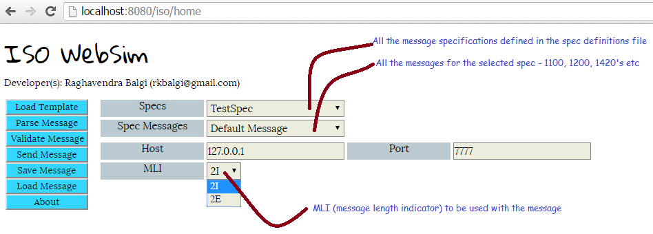
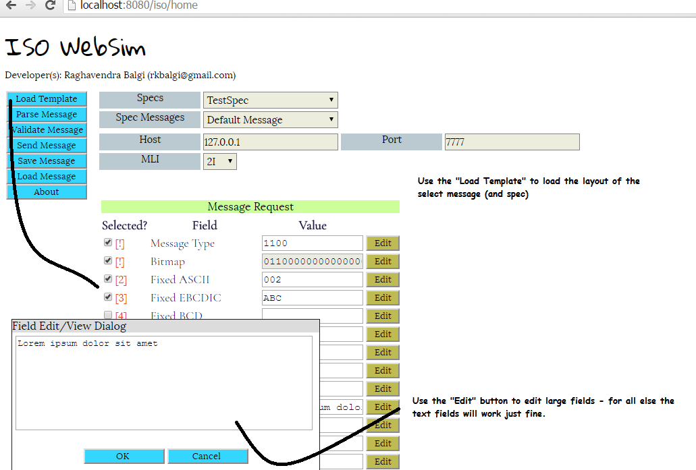
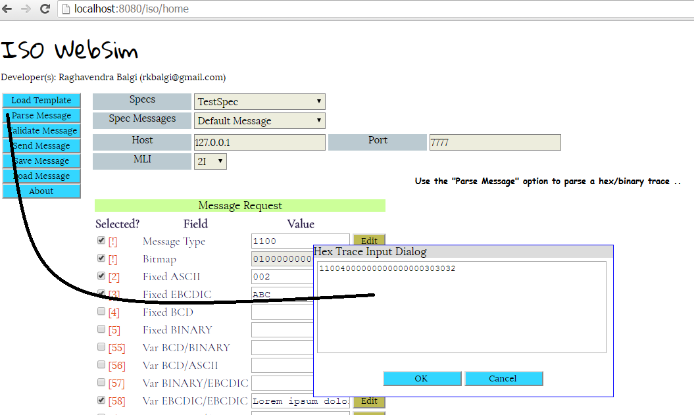
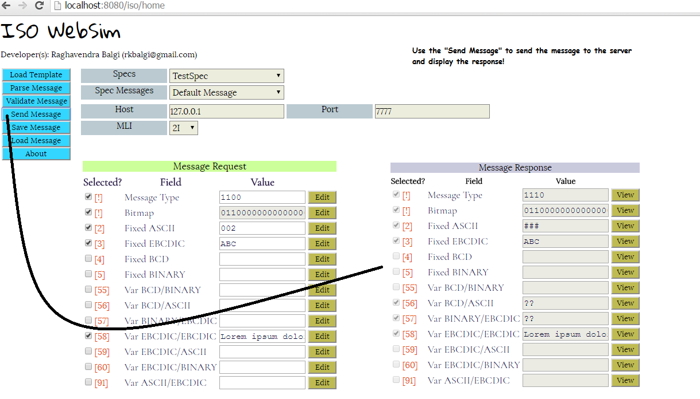
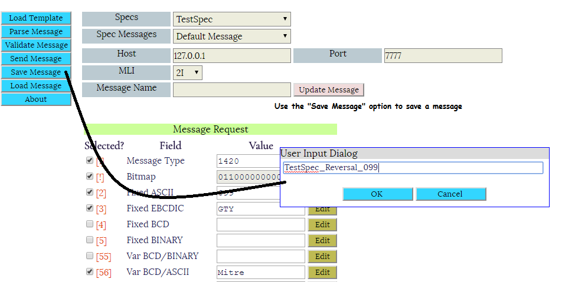
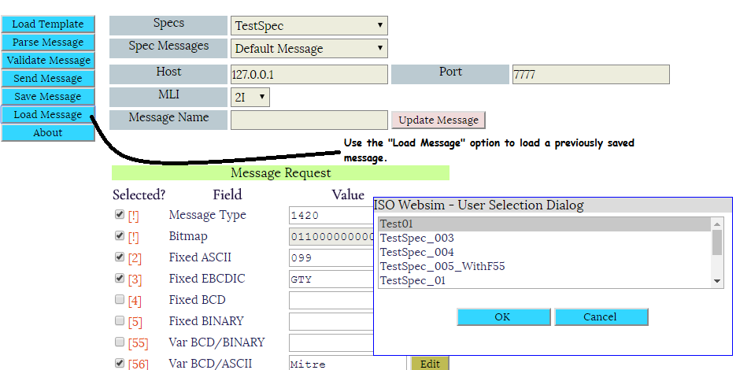
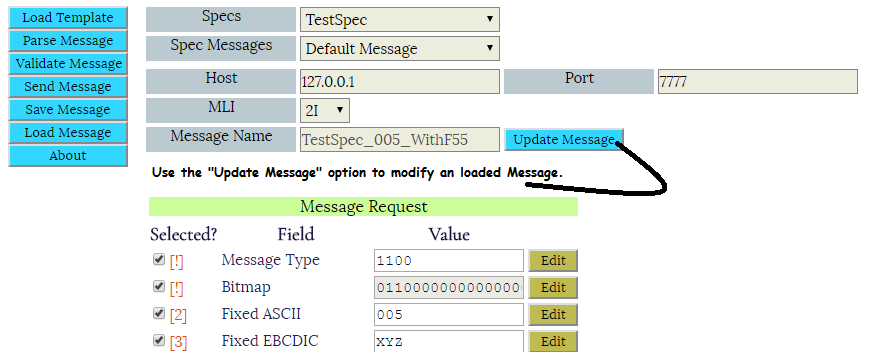

# ISO WebSim

Iso Websim is a ISO8583 simulator built using golang (http://golang.org). It provides a simple interface to load ISO specifications. 
The specifications themselves are defined in text file (more information on developing your own specs can be found in the [this] (./specs/isoSpec.spec?raw=true) file which you can use as a  sample to start with.

You can load an existing trace or create an ISO message from scratch and send it to an ISO host (identified by host and a port). 


The main program is started by the file isosim/isosim.go

###Disclaimers and bugs that I know of 
* __:warning: Please note that this application has been tested on chrome only (version 51.0.2704.103).__
* __:warning: Nested fields are supported only for bitmapped fields__

###Usage: 
```
C:>go run isosim.go -help
  -dataDir string
        Directory to store messages (data sets). This is a required field.
  -debugEnabled
        true if debug logging should be enabled. (default true)
  -htmlDir string
        Directory that contains any HTML's and js/css files etc. (default ".")
  -httpPort int
        Http port to listen on. (default 8080)
  -specDefFile string
        The file containing the ISO spec definitions. (default "isoSpec.spec")
exit status 2
```

###Sample Invocation 
C:\go run isosim.go -httpPort 8080 -specDefFile specs\isoSpecs.spec -htmlDir .\html 

And now open chrome and hit this URL [http://localhost:8080/iso/home](http://localhost:8080/iso/home)

###Screenshots
####Main

####Loading Template

####Parsing Message

####Validating Message

####Sending Message

####Save Message

####Load Message

####Update Message


